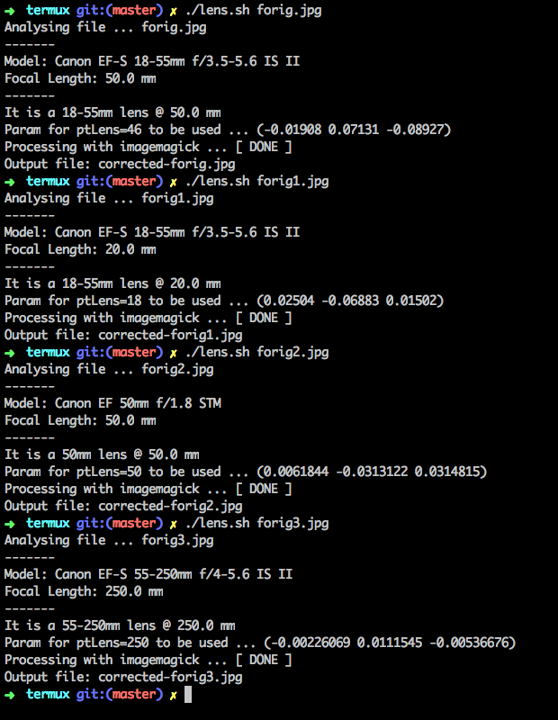

# Correct disortion with lensfun and imagemagick

Simple bash script to automate the [lens disortion](http://www.imagemagick.org/Usage/lens/) correction process. Idea was to use with [Termux](https://play.google.com/store/apps/details?id=com.termux&hl=en_IN) on my mobile.

## Imagemagick command demo

